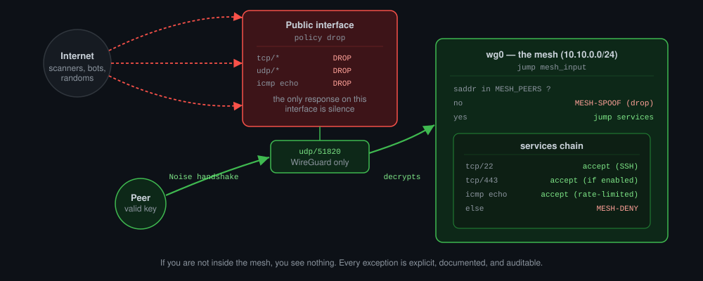
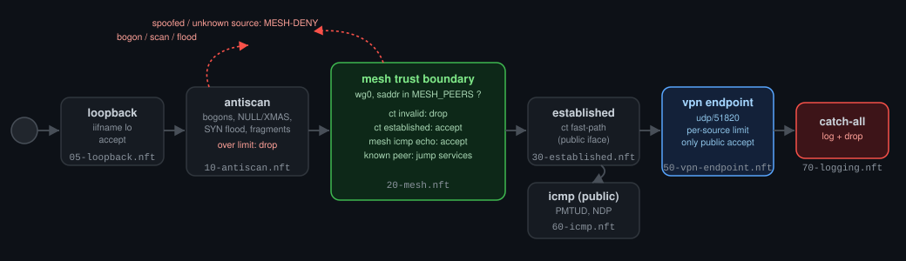

# ⛫ xnftables

[](https://opensource.org/licenses/MIT)
[](https://wiki.nftables.org/)
[](https://www.wireguard.com/)
[](https://www.kernel.org/)
[](https://github.com/paulfxyz/xnftables/actions)
[](./tests)
[](https://github.com/paulfxyz/xnftables/pulls)
[](https://github.com/paulfxyz/xnftables)

---

> **If you are not inside the mesh, you see nothing.**
>
> Deny-all defaults. Every exception is explicit, documented and auditable.
> Least privilege at the network layer.

---

## Table of contents

- [The idea](#the-idea)
- [Concepts](#concepts)
- [File structure](#file-structure)
- [Packet flow](#packet-flow)
- [Quick start](#quick-start)
- [WireGuard server setup](#wireguard-server-setup-vpnyourdomaincom)
- [Reloading safely](#reloading-safely)
- [Adding and removing services](#adding-a-service)
- [Reading the logs](#reading-the-logs)
- [Auditing the ruleset](#auditing-the-ruleset)
- [Testing the ruleset](#testing-the-ruleset)
- [Deploying to production](#deploying-to-production)
- [Security model](#security-model)
- [Known bugs fixed in v2](#known-bugs-fixed-in-v2)
- [Known bugs fixed in v3](#known-bugs-fixed-in-v3-the-5-model-audit)
- [nftables primer](#nftables-primer)
- [Why nftables over iptables](#why-nftables-over-iptables)
- [Why WireGuard over OpenVPN / IPsec](#why-wireguard-over-openvpn--ipsec)
- [Threat modelling](#threat-modelling)
- [Docker / Podman / LXC interaction](#docker--podman--lxc-interaction)
- [Tailscale / Netbird / Headscale adaptation](#tailscale--netbird--headscale-adaptation)
- [Security monitoring](#security-monitoring)
- [Advanced patterns](#advanced-patterns)
- [Hardening checklist](#hardening-checklist)
- [Compatibility](#compatibility)
- [References](#references)

---

## The idea

Most firewall configs are written backwards: start open, punch holes as problems appear, never clean them up. After a year you have a ruleset nobody fully understands, with ports open "just in case" and rules that reference services decommissioned in 2021.

`xnftables` inverts that. The only way traffic reaches this host is through a **WireGuard mesh**. The public internet sees exactly one thing: a UDP port for WireGuard handshakes. Everything else — SSH, HTTP, databases, monitoring — is invisible and unreachable unless you are an authenticated mesh peer.

This is a template policy, not a turnkey product. It is meant to be read, understood, and adapted. Every rule has a comment explaining *why* it exists, not just what it does.

---

## Concepts

### Deny-all default

```nft
chain input {
    type filter hook input priority filter; policy drop;
}
```

The kernel drops any packet that doesn't match a rule. There is no implicit "allow established", no loopback accept, nothing. Every `accept` is deliberate.

This feels uncomfortable the first time. It shouldn't. The alternative — "allow everything and block the bad stuff" — is an infinite game you will always lose. Attackers only need to find one gap. A deny-all policy means you define the entire surface.

### Mesh or nothing

[WireGuard](https://www.wireguard.com/) is a modern VPN protocol built into the Linux kernel since 5.6. Its key properties for this use case:

| Property | Implication |
|---|---|
| Cryptographic peer identity | A packet exiting `wg0` was decrypted with a session key derived from a pre-authorised peer keypair — it cannot be forged |
| Stealth on non-WireGuard traffic | Any datagram that doesn't decrypt correctly is silently dropped — the port appears closed to scanners |
| In-kernel performance | No userspace daemon overhead; same throughput as unencrypted kernel networking |
| Minimal attack surface | ~4,000 lines of code vs hundreds of thousands for OpenVPN/IPsec |

We trust the `wg0` interface at the network layer. A packet that arrived on `wg0` has already been cryptographically authenticated. We then perform a second check — source IP must be in the mesh CIDR — as defence-in-depth against misconfigured `AllowedIPs`.

<p align="center"></p>

### Explicit, named, auditable

Every rule carries a `comment` field. `nft list ruleset` shows them. Rules without comments are rejected in PR review.

Changes are committed to git with a message explaining *why* a service was added or removed. The git log is your audit trail. A CI workflow (`.github/workflows/validate.yml`) validates syntax on every push.

---

## File structure

```
nftables.conf                    ← entry point (scoped flush + includes)
rules/
  00-tables.nft                  ← table, chains, named sets (MESH_PEERS, BOGON_V4/V6…)
  05-loopback.nft                ← loopback unconditional accept (MUST be first)
  10-antiscan.nft                ← bogons, TCP flag abuse, SYN flood, fragments
  20-mesh.nft                    ← WireGuard trust boundary + break-glass + mesh ICMP
  30-established.nft             ← conntrack fast-path (public iface)
  40-services.nft                ← per-service allowlist (mesh peers only)
  50-vpn-endpoint.nft            ← WireGuard UDP port (per-source rate-limited)
  60-icmp.nft                    ← controlled ICMP/ICMPv6 (public iface)
  70-logging.nft                 ← catch-all log+drop (must stay last)
scripts/
  reload.sh                      ← safe reload with dry-run + confirm-or-revert
  check.sh                       ← syntax validator (pre-commit / CI)
  monitor/                       ← CVE / release monitor (see MONITOR.md)
tests/                           ← enforcement test suite — 29 TAP tests (see tests/README.md)
DEPLOYMENT.md                    ← production deployment checklist (phases 0–7)
MONITOR.md                       ← security monitoring guide
.github/
  workflows/validate.yml         ← CI: syntax, enforcement tests, SAST, secret scan
```

The include order matters. Loopback is accepted first (127.0.0.0/8 is in `BOGON_V4`, so antiscan would otherwise kill it — that was BUG v3-02). `10-antiscan` then drops impossible packets before any trust decisions. Logging is always last.

---

## Packet flow

<p align="center"></p>

The diagram above is the quick-reference version. The exact rule order, with every verdict spelled out, lives in the ASCII trace below — this is what you grep when debugging:

```
Incoming packet
      │
      ▼
[05-loopback]
  iifname == "lo"        ──────────────────────────────► ACCEPT
      │
      ▼
[10-antiscan]
  bogon source (v4/v6)?  ──────────────────────────────► LOG + DROP
  TCP NULL/XMAS/SYN+FIN? ──────────────────────────────► LOG + DROP
  SYN flood (over 30/s per source)? ───────────────────► LOG + DROP (under limit: continue)
  IP fragment (public)?  ──────────────────────────────► LOG + DROP
      │
      ▼
[20-mesh]
  ADMIN_ALLOWLIST + tcp/22 (break-glass, pre-wg0) ─────► ACCEPT (rate-limited)
  wg0 + saddr ∉ MESH_PEERS (v4/v6) ────────────────────► LOG + DROP (spoof)
  wg0                    ──────────────────────────────► jump mesh_input
                                  │
                           mesh_input:
                           ct invalid ───────────────────► LOG + DROP
                           ct established ──────────────► ACCEPT (fast-path)
                           icmp echo ∈ MESH_PEERS ──────► ACCEPT (mesh ping, rate-limited)
                           saddr ∈ MESH_PEERS ──────────► jump services
                                      │
                               services:
                               tcp/22  ─────────────────► ACCEPT (SSH, rate-limited)
                               tcp/443 ─────────────────► ACCEPT (if enabled)
                               …other explicit services…
                               no match ────────────────► back to mesh_input
                           anything left ───────────────► LOG + DROP (XNFT-MESH-DENY)
      │
      ▼
[30-established]  (public iface only — mesh handled above)
  ct invalid       ────────────────────────────────────► LOG + DROP
  ct established   ────────────────────────────────────► ACCEPT
      │
      ▼
[50-vpn-endpoint]
  udp/51820, over rate (per-source v4 / per-/64 v6) ────► LOG + DROP
  udp/51820                      ──────────────────────► ACCEPT (WireGuard, v4+v6)
      │
      ▼
[60-icmp]  (public iface — mesh ICMP handled in mesh_input)
  echo-request from internet     ──────────────────────► DROP (stealth, silent)
  PMTUD/traceroute types         ──────────────────────► ACCEPT (rate-limited)
  NDP (hoplimit 255 only, no nd-redirect) ─────────────► ACCEPT (rate-limited)
  nd-redirect                    ──────────────────────► LOG + DROP (MITM vector)
  everything else                ──────────────────────► LOG + DROP
      │
      ▼
[70-logging]  catch-all
  log (rate-limited 30/s)        ──────────────────────► LOG + DROP
```

---

## Quick start

### Prerequisites

- Linux kernel ≥ 5.6 (WireGuard built-in)
- nftables ≥ 0.9.3 (`nft --version`)
- A running WireGuard server at `vpn.yourdomain.com`
- Your mesh CIDR (this template uses `10.10.0.0/24`)

### 1. Clone

```bash
git clone https://github.com/paulfxyz/xnftables.git
cd xnftables
```

### 2. Adapt to your topology

Open `rules/00-tables.nft` and update the `MESH_PEERS` set:

```nft
set MESH_PEERS {
    type ipv4_addr
    flags interval
    elements = { 10.10.0.0/24 }   # ← your mesh CIDR
}
```

Open `rules/20-mesh.nft` and verify the WireGuard interface name (`wg0`). Open `rules/50-vpn-endpoint.nft` and verify the listen port matches `ListenPort` in your `wg0.conf`.

### 3. Enable services

Open `rules/40-services.nft` and uncomment what this host exposes to mesh peers:

```nft
tcp dport 443  accept comment "service: HTTPS app (mesh-only)"
tcp dport 9100 accept comment "service: Prometheus node exporter (mesh-only)"
```

### 4. Install and reload

```bash
# Dry-run first
sudo nft -c -f nftables.conf

# Install
sudo cp -r rules/ /etc/nftables/
sudo cp nftables.conf /etc/nftables.conf
chmod +x scripts/reload.sh scripts/check.sh

# Safe reload (validates, saves rollback, applies)
sudo ./scripts/reload.sh

# Verify
sudo nft list ruleset
```

### 5. Persist across reboots

```bash
sudo systemctl enable nftables
sudo systemctl start nftables
```

### 6. Install pre-commit hook

```bash
cp scripts/check.sh .git/hooks/pre-commit
chmod +x .git/hooks/pre-commit
```

The hook validates `.nft` syntax on every commit. Note: full validation (`nft -c` against the real include tree) requires root — without it the hook only performs lightweight structural checks and defers to CI, which runs the complete 9-job pipeline (syntax, enforcement tests, SAST, secret scan) on every push.

---

## WireGuard server setup (vpn.yourdomain.com)

### /etc/wireguard/wg0.conf (server)

```ini
[Interface]
Address    = 10.10.0.1/24
ListenPort = 51820
PrivateKey = <SERVER_PRIVATE_KEY>

# Routing between mesh peers (hub-and-spoke — optional)
PostUp   = iptables -A FORWARD -i wg0 -j ACCEPT; iptables -t nat -A POSTROUTING -o eth0 -j MASQUERADE
PostDown = iptables -D FORWARD -i wg0 -j ACCEPT; iptables -t nat -D POSTROUTING -o eth0 -j MASQUERADE

[Peer]
# workstation-alice
PublicKey  = <ALICE_PUBLIC_KEY>
AllowedIPs = 10.10.0.2/32

[Peer]
# server-prod-01
PublicKey  = <PROD01_PUBLIC_KEY>
AllowedIPs = 10.10.0.3/32
```

**AllowedIPs per peer** is WireGuard's first isolation layer — a peer assigned `10.10.0.2/32` cannot send traffic claiming to be `10.10.0.5`. Our `@MESH_PEERS` set is the second layer.

### /etc/wireguard/wg0.conf (client/peer)

```ini
[Interface]
Address    = 10.10.0.2/32
PrivateKey = <ALICE_PRIVATE_KEY>
DNS        = 10.10.0.1

[Peer]
PublicKey           = <SERVER_PUBLIC_KEY>
Endpoint            = vpn.yourdomain.com:51820
AllowedIPs          = 10.10.0.0/24   # route only mesh traffic through tunnel
PersistentKeepalive = 25
```

### Key generation

```bash
# Server key pair
wg genkey | tee server.key | wg pubkey > server.pub
chmod 600 server.key

# Peer key pair
wg genkey | tee peer.key | wg pubkey > peer.pub
chmod 600 peer.key

# Optional: pre-shared key (post-quantum resistance layer)
wg genpsk > peer.psk
chmod 600 peer.psk
```

Never commit private keys. Use a secrets manager (HashiCorp Vault, age-encrypted secrets, etc.).

### Peer revocation (without restarting WireGuard)

```bash
# Remove the [Peer] block from wg0.conf, then:
sudo wg syncconf wg0 <(wg-quick strip wg0)

# Verify the peer is gone
sudo wg show
```

---

## Reloading safely

**Never** run `sudo nft -f /etc/nftables/nftables.conf` directly without validating first. A syntax error in any include file after the table flush leaves the machine with **no firewall rules** — completely open.

### Safe reload script

```bash
sudo ./scripts/reload.sh
```

What it does:
1. Runs `nft -c` (dry-run — validates without touching state)
2. Saves a rollback snapshot of the current live ruleset to `/run/xnftables` (mode 600, prefixed with `flush ruleset` so a restore **replaces** state instead of merging into it)
3. Applies the new config
4. If `nft -f` fails, auto-reverts to the snapshot

### Remote-safe testing (confirm-or-revert)

When testing new rules on a remote server where a lockout would be catastrophic:

```bash
# Apply rules, then type 'keep' + Enter within 60 seconds — or they revert
sudo ./scripts/reload.sh --confirm-timeout 60
# If the new rules work: type keep ⏎ at the prompt
# If you get locked out: the prompt never receives input → automatic revert
```

The confirmation is a blocking read on the same SSH session — there is no background job to hunt down and kill. If your session dies because the new rules cut you off, the read times out and the snapshot is restored.

### Validate only (no apply)

```bash
sudo ./scripts/reload.sh --dry-run
# or directly:
sudo nft -c -f /etc/nftables/nftables.conf
```

---

## Adding a service

1. Uncomment or add a rule in `rules/40-services.nft`
2. Template: `tcp dport <PORT> accept comment "service: <NAME> — <PURPOSE> (mesh-only)"`
3. Dry-run: `sudo ./scripts/reload.sh --dry-run`
4. Reload: `sudo ./scripts/reload.sh`
5. Test from a mesh peer: `nc -zv 10.10.0.1 <PORT>`
6. Commit: `git commit -m "feat: open TCP/<PORT> for <NAME> on <host>"`

## Removing a service

Comment out the rule (don't delete it), reload, test, commit with a reason. The git diff is the audit trail.

---

## Reading the logs

All log lines are prefixed `XNFT-<CATEGORY>:` for easy filtering.

| Prefix | Meaning |
|---|---|
| `XNFT-DROP` | Catch-all drop — not matched by any allow rule |
| `XNFT-INVALID` | Conntrack invalid state (public iface) |
| `XNFT-MESH-INVALID` | Conntrack invalid state inside the mesh tunnel |
| `XNFT-MESH-SPOOF` | Packet inside `wg0` with source IP outside `@MESH_PEERS` |
| `XNFT-MESH-DENY` | Mesh peer traffic to a port not in the services allowlist |
| `XNFT-WG-RATELIMIT` | WireGuard handshake per-source rate limit exceeded |
| `XNFT-BREAKGLASS-RATELIMIT` | Break-glass SSH rate limit exceeded (brute-force attempt) |
| `XNFT-BOGON` | Bogon/martian IPv4 source on public interface |
| `XNFT-BOGON6` | Bogon/martian IPv6 source on public interface |
| `XNFT-LOOPBACK-SPOOF` | 127.x source on non-loopback interface |
| `XNFT-LOOPBACK6-SPOOF` | ::1 source on non-loopback interface |
| `XNFT-MESH-SPOOF6` | IPv6 packet inside `wg0` with source outside `@MESH_PEERS6` |
| `XNFT-NDP-OFFLINK` | NDP packet with hoplimit ≠ 255 (off-link forgery attempt) |
| `XNFT-TCPFL-NULL` | TCP NULL scan (no flags) |
| `XNFT-TCPFL-XMAS` | TCP XMAS scan (FIN+PSH+URG) |
| `XNFT-TCPFL-SYNFIN` | TCP SYN+FIN (impossible combination) |
| `XNFT-TCPFL-SYNRST` | TCP SYN+RST (impossible combination) |
| `XNFT-TCPFL-FIN` | TCP FIN scan (bare FIN on new connection) |
| `XNFT-SYNFLOOD` | SYN flood per-source rate limit exceeded |
| `XNFT-FRAGMENT` | Fragmented IPv4 packet on public interface |
| `XNFT-SSH-RATELIMIT` | SSH new-connection rate limit exceeded (mesh peer) |
| `XNFT-ICMP4-DROP` | Unmatched IPv4 ICMP |
| `XNFT-ICMP4-EXCESS` | ICMP essential types rate limit exceeded |
| `XNFT-ICMP6-DROP` | Unmatched ICMPv6 |
| `XNFT-ICMP6-REDIRECT` | ICMPv6 nd-redirect dropped (MITM vector) |
| `XNFT-ICMP6-EXCESS` | ICMPv6 PMTUD rate limit exceeded |
| `XNFT-NDP-EXCESS` | NDP rate limit exceeded |
| `XNFT-FWD-DROP` | Forward chain drop |
| `XNFT-FWD-INVALID` | Forward chain invalid conntrack state |

### Live monitoring

```bash
# All xnftables events
journalctl -k -f | grep "XNFT-"

# Scan activity only
journalctl -k -f | grep -E "XNFT-(TCPFL|BOGON|SYNFLOOD|FRAGMENT)"

# Top source IPs in the catch-all (last 1000 lines)
journalctl -k -n 1000 | grep "XNFT-DROP" \
  | grep -oP 'SRC=\S+' | sort | uniq -c | sort -rn | head -20

# Decode a log line
# Apr 26 19:01:44 host kernel: XNFT-TCPFL-XMAS: IN=eth0 SRC=185.220.101.5
#   DST=10.0.0.1 PROTO=TCP SPT=54321 DPT=443 FIN PSH URG
```

### SIEM / Loki forwarding

```
# /etc/rsyslog.conf — forward all XNFT events to remote syslog
:msg, contains, "XNFT-"  @your-siem-host:514

# Or write to a dedicated file
:msg, contains, "XNFT-"  /var/log/xnftables.log
& stop
```

---

## Auditing the ruleset

```bash
# Dump the full live ruleset
sudo nft list ruleset

# List only the services chain
sudo nft list chain inet filter services

# List named sets (peer CIDRs)
sudo nft list sets

# Live rule hit counters (add 'counter' to any rule first)
watch -n 1 'sudo nft list chain inet filter services'

# Validate without applying
sudo nft -c -f /etc/nftables/nftables.conf

# Trace a specific packet through the ruleset
sudo nft 'add rule inet filter input meta nftrace set 1'
sudo nft monitor trace
# remove the trace rule after:
sudo nft list chain inet filter input -a
sudo nft delete rule inet filter input handle <HANDLE>
```

---

## Testing the ruleset

The [`tests/`](./tests) directory contains a 29-test enforcement suite that loads the ruleset into an isolated network namespace and fires real packets at it — verifying that the mesh actually accepts, the internet actually gets dropped, spoofed sources are caught, and rate limits trigger.

```bash
# Run everything in an isolated netns (requires root; nothing touches your live firewall)
sudo ./tests/run-tests.sh --netns

# Verbose TAP output
sudo ./tests/run-tests.sh --netns --verbose
```

The same suite runs in CI on every push (ubuntu-24.04, real kernel, real nftables), so a rule change that silently breaks enforcement fails the build — not your production host. See [tests/README.md](./tests/README.md) for the full test matrix and how to add tests for new services.

---

## Deploying to production

[DEPLOYMENT.md](./DEPLOYMENT.md) is a phase-by-phase checklist for moving this ruleset onto a remote host without locking yourself out: pre-flight audit, out-of-band access, WireGuard-first ordering, staged apply with `--confirm-timeout`, post-deploy verification from inside and outside the mesh, and rollback procedures. Read it before touching a machine you cannot walk over to.

---

## Security model

### What this policy protects against

| Threat | Mitigation |
|---|---|
| Port scanning from the internet | Default drop; only UDP/51820 responds, and only to valid WireGuard datagrams |
| Service enumeration | No ports respond to unauthenticated connections |
| Brute-force SSH | SSH is invisible to non-mesh traffic; rate-limited within mesh |
| Spoofed source IPs inside tunnel | WireGuard `AllowedIPs` + nftables `@MESH_PEERS` dual check |
| WireGuard handshake flood (DoS) | Per-source meter — attacker can only exhaust their own budget |
| TCP scan techniques (NULL/XMAS/FIN) | Detected and dropped in `10-antiscan.nft` with dedicated log prefixes |
| SYN flood | Per-source rate limit (+ kernel SYN cookies recommended) |
| Bogon / martian source addresses | `BOGON_V4` set blocks RFC1918/documentation/reserved ranges on public iface |
| IP fragmentation attacks | Fragments dropped on public interface |
| Invalid conntrack state (mesh) | Checked inside `mesh_input` before service rules — bugs 1B/2A fixed |
| PMTUD blackhole injection | ICMP dest-unreachable rate-limited to 10/s |
| ICMPv6 MITM via nd-redirect | `nd-redirect` explicitly dropped — bug 4B fixed |
| NDP neighbour-cache exhaustion | NDP rate-limited at 50/s |
| Unsafe reload (open window) | Scoped table flush + `reload.sh` dry-run guard |
| Docker NAT table destruction | Scoped flush instead of `flush ruleset` — bug 10A fixed |

### What this policy does NOT protect against

| Threat | Notes |
|---|---|
| Compromised mesh peer | A valid key can reach all open services. Use per-peer rules for isolation. |
| Application-layer vulnerabilities | nftables is L3/L4. Deploy a WAF for HTTP-level threats. |
| Egress data exfiltration | Output policy is `accept` by default. Add egress rules if needed. |
| Physical / hypervisor compromise | Out of scope for a network firewall. |

---

## Known bugs fixed in v2

This section documents every bug found in v1 and how it was fixed. Transparency about past mistakes is part of what makes a ruleset auditable.

### BUG 1A — Anti-spoof rule was dead code

**v1 code:**
```nft
chain input {
    iifname "wg0" jump mesh_input         # ← all wg0 packets diverted here
    iifname "wg0" ip saddr != @MESH_PEERS # ← DEAD: never reached
        log prefix "XNFT-MESH-SPOOF: " drop
}
```
`jump` transfers control to `mesh_input` which always terminates with `accept` or `drop`. The second rule was unreachable. `XNFT-MESH-SPOOF:` never appeared in logs. Any monitoring built on that prefix was silently broken.

**Fix:** Spoof check moved before the jump.

---

### BUG 1B / 2A — Conntrack invalid check bypassed for mesh traffic

All `wg0` packets entered `mesh_input` and hit `jump services` before the `ct state invalid drop` in `30-established.nft`. A compromised mesh peer could send invalid-state packets directly to services.

**Fix:** Conntrack checks (`ct invalid` drop + `ct established` accept) added at the top of `mesh_input`.

---

### BUG 3A — WireGuard rate limit was a single shared bucket

```nft
udp dport 51820 limit rate 20/minute accept  # global counter
```
One attacker sending 20 UDP/minute exhausted the entire budget. All other legitimate peers hit the rate limit for the rest of that minute window. Classic deny-of-service against the WireGuard endpoint itself.

**Fix:** Replaced with a `meter` — one independent token bucket per source IP.

---

### BUG 4B — `nd-redirect` accepted from any source (IPv6 MITM)

ICMPv6 Redirect (type 137) instructs the host to change its first-hop router for a destination. Accepting it from any source allowed an attacker on the same network segment to silently redirect IPv6 connections through their machine. RFC 4861 §8.1 requires redirects come from the current first-hop router only, which on a WireGuard mesh doesn't apply.

**Fix:** `nd-redirect` removed from the NDP accept list; explicit log+drop rule added.

---

### BUG 7A — Break-glass SSH was permanently unreachable

The `ADMIN_ALLOWLIST` SSH rule was inside the `services` chain, which is only reachable from `mesh_input`, which only fires for `iifname "wg0"` traffic. When WireGuard goes down (the exact scenario requiring break-glass), the rule never fired.

**Fix:** Break-glass rule moved to the `input` chain, before the `wg0` jump, with its own rate limit.

---

### BUG 9A — Forward chain dropped all established forwarded traffic

The forward chain had `policy drop` but no `ct state established accept`. WireGuard hub routing (where this host forwards traffic between mesh peers) silently dropped all forwarded connections.

**Fix:** `ct invalid` drop + `ct established` accept added to forward chain in `70-logging.nft`.

**Honesty note (v3):** this fix was incomplete. With no `ct state new` accept in the forward chain, no forwarded connection could ever *become* established — the established accept was dead code and hub routing still didn't work. See BUG v3-11 below.

---

### BUG 10A — `flush ruleset` destroyed Docker/libvirt NAT rules

`flush ruleset` removes ALL tables across ALL families — including Docker's `ip nat` and `ip filter` tables. Docker doesn't reinject them until restart. After any nftables reload, container networking silently broke.

**Fix:** Replaced `flush ruleset` with scoped table operations:
```nft
add table inet filter
delete table inet filter
```
Only the `inet filter` table is touched. Docker's tables are untouched.

---

### BUG 13A — Unsafe reload left machine open on syntax error

`flush ruleset` (now fixed as 10A) executed immediately when encountered. A syntax error in any subsequent include caused: rules flushed, load aborted, machine left with no firewall.

**Fix:** `reload.sh` script validates with `nft -c` before applying. Scoped table flush means a failed load leaves the old rules intact rather than leaving nothing.

---

## Known bugs fixed in v3 (the 5-model audit)

For v3, the entire repository was independently audited by five frontier AI models, and every finding was cross-checked against `man nft`, kernel behaviour, and a real-packet test suite. The two worst findings were **breaking**: v2 could not load at all on modern nftables (≥1.1), and even where it loaded, it dropped every new TCP connection. If you are running v2, upgrade now.

### BUG v3-01 — SYN-flood meter killed ALL new TCP connections (CRITICAL)

**v2 code:**
```nft
tcp flags & syn == syn ct state new \
    meter syn_flood { ip saddr timeout 10s limit rate 30/second } \
    comment "antiscan: SYN rate-limit meter (per-source)"        # ← NO VERDICT

tcp flags & syn == syn ct state new \
    log prefix "XNFT-SYNFLOOD: " drop comment "rate-limit exceeded"
```
The first rule has **no verdict** — matching a meter and then doing nothing is a no-op, so evaluation always continues to the second rule, which logs and drops **every** new SYN, under or over the limit. Since antiscan runs before the mesh chains, every new TCP connection on the box — mesh included — was dropped. Established flows kept working (their packets aren't bare SYNs), which makes this the nastiest kind of bug: everything looks fine until the first reconnect.

**Fix:** a single meter with `limit rate over 30/second` that jumps to a dedicated `synflood_drop` chain (rate-limited log, unconditional drop). Under-limit SYNs fall through to normal evaluation. An IPv6 meter (keyed per /64 to resist address-hopping) was added alongside — v2 had no IPv6 SYN protection at all.

### BUG v3-02 — Antiscan ran before loopback: all local traffic dropped (CRITICAL)

`127.0.0.0/8` is (correctly) in `BOGON_V4`. But the v2 include order ran the bogon check **before** the loopback accept — so every packet on `lo` was logged and dropped. Postgres on localhost, systemd-resolved, anything using 127.0.0.1: dead. Files renumbered (`05-loopback.nft` now precedes `10-antiscan.nft`) so loopback is accepted before any bogon logic.

### BUG v3-03 — Mesh ICMP rules were dead code

`60-icmp.nft` had "allow ping from mesh peers" rules — but every wg0 packet was consumed by `jump mesh_input` in `20-mesh.nft` long before reaching file 60. Mesh peers could never ping the server. The echo accepts (v4+v6, rate-limited) now live inside `mesh_input` itself; `60-icmp.nft` is explicitly public-interface-only.

### BUG v3-04 — WireGuard rate limiter: IPv6 lockout + fail-closed meter

The v2 pattern was `meter { ip saddr … } accept` followed by an unconditional log+drop. Three problems. **(1) IPv6 lockout:** the meter matched `ip saddr` only, so every IPv6 datagram skipped the accept and hit the drop — IPv6 clients could never complete a handshake. **(2) Fail-closed:** the unbounded meter table, once full, could not track new sources — they never matched the accept and were dropped. An attacker who fills the meter locks every *new* peer out of the VPN. **(3)** 5/minute flirted with dropping legitimate handshake retries (initiations retransmit every ~5s).

**Fix:** inverted to `limit rate over 10/minute` → dedicated log+drop chain (per-source v4, per-/64 v6 — an attacker owns their whole /64, so per-address v6 buckets could be rotated through), then `udp dport 51820 counter accept` — deliberately the **only** public accept in the entire ruleset, now covering both address families. Meters are bounded (`size 65535`) and a full meter degrades to "no rate limiting" (fail-open) — acceptable because WireGuard authenticates cryptographically; the rate limit is noise reduction, not the security boundary, and it must never become the outage.

### BUG v3-05 — `ip6 nexthdr icmpv6` missed ICMPv6 behind extension headers

`nexthdr` matches only the *first* header after the fixed IPv6 header. An attacker inserting a hop-by-hop or fragment extension header bypassed every ICMPv6 rule written with `nexthdr`. All ICMPv6 matching now uses `meta l4proto icmpv6`, which walks the extension-header chain.

### BUG v3-06 — IPv6 mesh spoof check existed but was commented out

The v2 anti-spoof for IPv6 (`@MESH_PEERS6`) was scaffolding-only. It is now active: with an empty `MESH_PEERS6` set the mesh is deny-all for IPv6 (fail-closed), and spoofed v6 sources log as `XNFT-MESH-SPOOF6`.

### BUG v3-07 — `XNFT-MESH-UNKNOWN` was a lie

The prefix implied "unknown peer", but the rule actually fires for **known** peers hitting ports not in the services allowlist (unknown sources are caught earlier by the spoof check). Renamed to `XNFT-MESH-DENY` with an honest comment. If you built alerting on `MESH-UNKNOWN`, update it.

### BUG v3-08 — Fragment check missed the more-fragments flag

Mask `0x1fff` catches only non-zero fragment *offsets* — the first fragment of a fragmented packet (offset 0, MF=1) passed through. Mask is now `0x3fff` (offset bits + MF bit), catching every fragment including the first.

### BUG v3-09 — SSH rate limit was a single global bucket

Same class as v2's BUG 3A, missed in the SSH rules: `limit rate 6/minute` is one shared counter, so one noisy peer locked every other mesh peer out of SSH. Replaced with per-source meters (`ssh_rl` / `ssh_rl6`, over 6/minute → log+drop chain).

### BUG v3-10 — NDP accepted with any hop limit

RFC 4861 requires NDP packets arrive with hoplimit 255 (proof the packet wasn't forwarded). v2 accepted NDP at any hop limit, allowing off-link NDP injection. Now only hoplimit-255 NDP is accepted; the rest logs as `XNFT-NDP-OFFLINK`.

### BUG v3-11 — Forward chain could never establish a connection

The v2 BUG 9A "fix" added `ct established accept` to the forward chain but no `ct state new` rule — so the first packet of any forwarded flow was dropped and nothing ever became established. Hub routing remained broken while the README claimed it fixed. A commented hub-routing template (mesh-to-mesh `ct state new` accept + `ip_forward` sysctl instructions) now ships in `70-logging.nft`; the default remains deny-all forwarding.

### BOGON set rejected by modern nftables (BREAKING)

`255.255.255.255/32` overlapped with `240.0.0.0/4` in the `BOGON_V4` interval set. nftables ≥1.1 rejects conflicting intervals at load time — **v2 did not load at all** on Ubuntu 24.04+, Debian 13, Arch, or any current distro. The redundant element was removed (240/4 already covers it).

### Tooling fixes in the same audit

- **reload.sh**: snapshot now written to root-owned `/run/xnftables` with mode 600 (was world-readable `/tmp`, a TOCTOU + information-disclosure risk); restore file begins with `flush ruleset` so a rollback **replaces** the live ruleset instead of merging into it; the `--confirm-timeout` revert is now a blocking "type `keep`" prompt instead of a background job you had to race to kill.
- **check.sh**: no longer exits 0 silently when run without root — it tells you what it could and couldn't validate.
- **monitor**: the notification pipeline had a bug where a log line written to stdout corrupted the JSON findings payload — the monitor could detect a CVE and then crash before notifying anyone. Logs now go to stderr, secrets never appear on argv, and the systemd unit is fully sandboxed. See [MONITOR.md](./MONITOR.md).
- **CI**: all actions pinned to commit SHAs, all third-party binaries pinned to SHA-256 checksums, secret scanning (gitleaks), workflow audit (zizmor), and the enforcement test suite now run on every push — 9 jobs total.

---

## nftables primer

### Tables and chains

In `iptables` the tables (`filter`, `nat`, `mangle`) are fixed. In nftables you create your own tables with any name, and define which hooks they attach to and at what priority.

```nft
table inet filter {        # "inet" = covers IPv4 + IPv6 simultaneously
    chain input {
        type filter        # hook type: filter, nat, or route
        hook input         # netfilter hook: input, forward, output, prerouting, postrouting
        priority filter;   # priority 0; use "raw" (-300) for early-exit optimisation
        policy drop;       # default verdict if no rule matches
    }
}
```

### Rule anatomy

```nft
[match expressions]  [statement]  [comment]

# Examples:
iifname "wg0"  ip protocol tcp  tcp dport 22  accept  comment "SSH from mesh"
ct state { established, related }  accept  comment "conntrack fast-path"
ip saddr @MESH_PEERS  jump services  comment "known peer"
meter syn_flood { ip saddr limit rate 30/second }  comment "SYN rate-limit"
limit rate 5/second  log prefix "DROP: "  drop  comment "rate-limited drop"
```

### Sets and meters

**Sets** match against lists or ranges in O(1):
```nft
set BOGON_V4 {
    type ipv4_addr
    flags interval
    elements = { 10.0.0.0/8, 192.168.0.0/16, 172.16.0.0/12 }
}
ip saddr @BOGON_V4 drop
```

**Meters** (named sets with `dynamic` flag) create per-source token buckets:
```nft
# Each source IP gets its own independent bucket
tcp flags syn  meter syn_flood { ip saddr timeout 10s limit rate 30/second }  accept
```
Without a meter, `limit rate 30/second` is a single global counter — one source exhausts the budget for everyone.

### Verdict maps

Route traffic to different chains based on a key — avoids long if/else chains:
```nft
tcp dport vmap {
    22   : jump ssh_chain,
    80   : jump http_chain,
    443  : jump https_chain
}
```

### Atomic reload

```bash
# This is atomic — old rules replaced in a single transaction:
nft -f /etc/nftables/nftables.conf
# If the file has errors, the old rules remain intact (with scoped flush).
```

### Priorities

| Alias | Value | Use case |
|---|---|---|
| `raw` | -300 | Before conntrack — drop malicious packets before they enter state table |
| `mangle` | -150 | Packet modification (TTL, DSCP) |
| `filter` | 0 | Standard filtering (this ruleset) |
| `security` | 50 | SELinux / AppArmor hooks |

Moving `ct state invalid drop` to a `raw` priority chain would prevent invalid packets from entering the conntrack table at all — a performance and resource gain. See the "Advanced patterns" section.

---

## Why nftables over iptables

| | iptables | nftables |
|---|---|---|
| IPv4 + IPv6 | Separate `iptables` / `ip6tables` | Single `inet` table |
| Rule evaluation | Linear scan | JIT bytecode, O(1) set lookups |
| Atomic reload | Not atomic | Fully atomic transactions |
| Named sets | Requires external `ipset` | Built-in, first-class |
| Per-source rate limit | Requires `hashlimit` module | Native `meter` |
| Rule comments | Not supported | `comment` field on every rule |
| Scripting | Shell string concatenation | Include system, variables, maps |
| Maintenance | Legacy — no new features | Actively developed |

`iptables` is now a compatibility shim over nftables on modern distros (`iptables-legacy` calls `nft` internally). There is no reason to use it for new deployments.

---

## Why WireGuard over OpenVPN / IPsec

| | OpenVPN | IPsec (strongSwan) | WireGuard |
|---|---|---|---|
| Codebase size | ~70,000 lines | ~400,000 lines | ~4,000 lines |
| Attack surface | Large (userspace TLS) | Very large | Minimal |
| Performance | ~200–400 Mbps | ~400–600 Mbps | Line-rate |
| Key exchange | TLS / certificates | IKEv1/IKEv2 | Noise Protocol |
| Configuration | Complex | Very complex | 5–10 lines per peer |
| Kernel integration | Userspace daemon | Partial | Native (kernel 5.6+) |
| Roaming | Limited | Limited | Automatic |

WireGuard's cryptographic primitives:
- **Curve25519** — Diffie-Hellman key exchange
- **ChaCha20-Poly1305** — authenticated encryption
- **BLAKE2s** — hashing
- **SipHash24** — hashtable keys

No negotiable cipher suites. No downgrade attacks. No BEAST/POODLE-class vulnerabilities.

---

## Threat modelling

### The internet scanner

They find your server IP (it's in DNS, BGP, certificate transparency logs). They run:
```
nmap -sS -sV -O -p- your.server.ip
```

With `xnftables` active:
```
Not shown: 65534 filtered tcp ports (no-response)
PORT      STATE         SERVICE
51820/udp open|filtered unknown
```

One port. No banner. No service version. No OS fingerprint.

Without it (default Ubuntu):
```
PORT   STATE SERVICE VERSION
22/tcp open  ssh     OpenSSH 9.6p1 Ubuntu
80/tcp open  http    nginx 1.26.0
443/tcp open https   nginx 1.26.0
```

Three services, exact versions, ready for CVE matching.

### The TCP scanner

Stealth scanners use invalid TCP flag combinations to probe without completing a handshake:

```
nmap -sN your.server.ip   # NULL scan: no flags
nmap -sX your.server.ip   # XMAS scan: FIN+PSH+URG
nmap -sF your.server.ip   # FIN scan: bare FIN
```

`10-antiscan.nft` drops all of these with dedicated log prefixes, so you can see the scan attempt in logs and correlate with other activity.

### The compromised mesh peer

WireGuard guarantees authentication, not authorisation. A peer with a valid key pair can reach all services that `40-services.nft` opens. Mitigations:

1. **Per-peer sub-chains** (see Advanced patterns)
2. **Immediate revocation** — `wg syncconf wg0 <(wg-quick strip wg0)` without restart
3. **mTLS at the application layer** — client certificates for sensitive services
4. **Egress control** — if a peer is compromised, limit what it can reach from this host

### Off-path ICMP attacks

Even with the source restriction on `echo-request`, `destination-unreachable` must be accepted from the internet (required for PMTUD). An off-path attacker who knows a TCP connection's 4-tuple (src IP, src port, dst IP, dst port) can:

- Send a forged `type 3 code 4` (frag-needed) with `MTU=68` — forces retransmission at minimum size, crushing throughput
- Send a forged `type 3 code 1` (host unreachable) — can terminate a TCP connection

These attacks require knowing the 4-tuple (difficult but not impossible for long-lived connections). Mitigation: the rate limit on ICMP essential types (10/s) bounds the impact. For high-security environments, consider restricting `destination-unreachable` to `ct state established` only — at the cost of potential PMTUD issues for new connections.

---

## Docker / Podman / LXC interaction

Container runtimes inject their own nftables/iptables rules for NAT and forwarding. Understanding the interaction is critical.

### Docker

Docker manages two nftables-compatible tables in the `ip` family (IPv4 only):
- `ip nat` — DNAT for port forwarding (`-p 8080:80`), MASQUERADE for egress
- `ip filter` — the `DOCKER` and `DOCKER-USER` chains

**The `flush ruleset` problem (BUG 10A):** `flush ruleset` destroys ALL tables in ALL families, including Docker's. Container networking breaks silently. `xnftables` uses scoped flush (`add table / delete table`) to avoid this.

**Port exposure conflict:** If Docker exposes a container port (`-p 8080:80`), it adds DNAT rules to `ip nat` that bypass the `inet filter` table entirely. A container port published with `-p` is reachable from the internet even if `inet filter` drops port 8080.

To fix this: either use `--network=host` containers managed by nftables directly, or add DOCKER-USER rules:
```bash
# Block all container port-forward access from the internet
# (allow only from mesh peers or localhost)
iptables -I DOCKER-USER -i eth0 ! -s 10.10.0.0/24 -j DROP
```

Or use `docker run --network=none` / `--network=container:name` for containers that should only talk on the mesh.

**Best practice:** Run containers without `-p` port publishing. Access them via their mesh IP if the container host is a WireGuard peer, or via a reverse proxy on the mesh.

### Podman (rootless)

Rootless Podman uses `pasta` or `slirp4netns` for networking, which operates in user namespaces. It doesn't touch the host's nftables tables. No conflict.

Rootful Podman behaves like Docker and has the same DNAT bypass issue.

### LXC / LXD

LXD creates a bridge interface (`lxdbr0`) and manages forwarding via iptables-compat. The `flush ruleset` issue applies. Use scoped flush (already in `xnftables`) and add forwarding rules if needed:

```nft
chain forward {
    # Allow LXD container traffic
    iifname "lxdbr0" accept comment "forward: LXD bridge egress"
    oifname "lxdbr0" accept comment "forward: LXD bridge ingress"
}
```

---

## Tailscale / Netbird / Headscale adaptation

`xnftables` uses WireGuard directly. Tailscale, Netbird, and Headscale are control-plane layers on top of WireGuard — the nftables policy adapts with minimal changes.

### Tailscale

Tailscale manages WireGuard via its own daemon and creates a `tailscale0` interface. Replace `wg0` with `tailscale0`:

```nft
# 20-mesh.nft — change interface name
iifname "tailscale0" jump mesh_input

# 10-antiscan.nft — exclude tailscale interface from bogon filter
iifname != "tailscale0" ip saddr @BOGON_V4 drop
```

Tailscale assigns IPs from `100.64.0.0/10` (CGNAT space) by default. Update `MESH_PEERS`:
```nft
set MESH_PEERS {
    type ipv4_addr
    flags interval
    elements = { 100.64.0.0/10 }  # Tailscale CGNAT range
}
```

And remove `100.64.0.0/10` from `BOGON_V4` (it's in there by default as RFC6598).

WireGuard port: Tailscale uses ephemeral UDP ports, not 51820. Remove or comment out `50-vpn-endpoint.nft` — Tailscale manages its own NAT traversal.

### Netbird

Netbird also creates a WireGuard interface (typically `wt0`) with a configurable CIDR. Substitute `wt0` for `wg0` and your Netbird CIDR for `10.10.0.0/24`.

### Headscale (self-hosted Tailscale coordinator)

Interface is still `tailscale0`. Changes are identical to the Tailscale section above.

---

## Security monitoring

Rulesets rot.  Kernel netfilter patches land weekly.  New CVEs get published against `nftables` and `conntrack` without fanfare.  A rule that was correct today may have a known bypass tomorrow.

`scripts/monitor/xnft-monitor.sh` is a weekday script that scans five upstream sources and pings you only when something security-relevant changes:

| Source | What it detects |
|---|---|
| kernel.org | New stable kernel releases |
| netfilter.org | New `nftables` / `nft` releases |
| NVD CVE API | `nftables` / `netfilter` CVEs published in the last 7 days |
| netfilter-devel mailing list | Thread subjects matching CVE, UAF, bypass, crash, heap overflow… |
| kernel.org netfilter git | Recent `net/netfilter` commit subjects matching security keywords |

Every finding is automatically mapped to the rule file most likely affected (a conntrack CVE → `rules/30-established.nft`, a WireGuard patch → `rules/20-mesh.nft` + `rules/50-vpn-endpoint.nft`, etc.) so the notification is immediately actionable.

Notifications go to whichever of **Slack, Discord, email, Notion** you configure.  Only HIGH and CRITICAL findings trigger pings.  MEDIUM findings (new releases, API changes) go to Notion only.  The digest prints to stdout; diagnostic logs go to stderr.  Secrets are never passed on the command line (curl reads them via `--config -` on stdin).

### Quickstart

```bash
cd scripts/monitor
cp .env.example .env && $EDITOR .env   # fill in your webhook URLs / tokens
chmod 600 .env                         # script refuses world-readable secrets
chmod +x xnft-monitor.sh

# Test — dry-run, no notifications sent
./xnft-monitor.sh --dry-run

# Add to crontab (weekdays at 08:00)
crontab -e
# 0 8 * * 1-5 /opt/xnftables/scripts/monitor/xnft-monitor.sh >> /var/log/xnft-monitor.log 2>&1

# Or use the systemd timer
sudo cp monitor.service /etc/systemd/system/xnft-monitor.service
sudo cp monitor.timer   /etc/systemd/system/xnft-monitor.timer
sudo systemctl enable --now xnft-monitor.timer
```

Full documentation: **[MONITOR.md](./MONITOR.md)**

---

## Advanced patterns

### Per-peer isolation

Limit what each mesh peer can reach:

```nft
chain services {
    # Alice's workstation: SSH only
    ip saddr 10.10.0.2 tcp dport 22    accept comment "peer alice: SSH"
    ip saddr 10.10.0.2                 drop   comment "peer alice: deny all else"

    # CI server: PostgreSQL and node exporter only
    ip saddr 10.10.0.3 tcp dport 5432  accept comment "peer ci: PostgreSQL"
    ip saddr 10.10.0.3 tcp dport 9100  accept comment "peer ci: node exporter"
    ip saddr 10.10.0.3                 drop   comment "peer ci: deny all else"
}
```

### Output egress control

```nft
chain output {
    type filter hook output priority filter; policy drop;
    oifname "lo"                      accept comment "egress: loopback"
    ct state { established, related } accept comment "egress: established"
    ct state invalid                  drop   comment "egress: invalid state"
    udp dport 53                      accept comment "egress: DNS"
    tcp dport 53                      accept comment "egress: DNS/TCP"
    udp dport 123                     accept comment "egress: NTP"
    tcp dport { 80, 443 }             accept comment "egress: HTTP/HTTPS"
    udp dport 51820                   accept comment "egress: WireGuard"
    log prefix "XNFT-EGRESS-DROP: "   drop   comment "egress: catch-all"
}
```

### Mesh hub routing (WireGuard server forwards between peers)

```nft
chain forward {
    type filter hook forward priority filter; policy drop;
    ct state invalid  drop
    ct state { established, related }  accept
    iifname "wg0" oifname "wg0"
        ip saddr @MESH_PEERS ip daddr @MESH_PEERS
        accept comment "forward: mesh-to-mesh via hub"
    log prefix "XNFT-FWD-DROP: " drop
}
```

### Connection rate limiting per service

Use a per-source meter with `limit rate over` — a bare `limit rate` is a single global bucket (one noisy client locks everyone out), and a meter *without* `over` matches the packets **under** the limit, which inverts the logic entirely (see BUG v3-01):

```nft
tcp dport 22 ct state new \
    meter ssh_rl { ip saddr timeout 60s limit rate over 6/minute } \
    jump ssh_ratelimit_drop comment "service: SSH per-source rate-limit"
tcp dport 22 accept comment "service: SSH"

chain ssh_ratelimit_drop {
    limit rate 5/minute log prefix "XNFT-SSH-RATELIMIT: " comment "log (rate-limited)"
    drop comment "drop everything over the meter limit"
}
```

### Early invalid-drop at raw priority (performance)

Moving `ct state invalid` to the `raw` hook prevents invalid packets from entering the conntrack table at all, which is a significant resource saving under flood conditions:

```nft
table inet raw {
    chain prerouting {
        type filter hook prerouting priority raw; policy accept;
        ct state invalid  log prefix "XNFT-RAW-INVALID: " drop
        # Optional: notrack for high-volume UDP flows that don't need state
        # udp dport 51820  notrack
    }
}
```

### Port knocking (pure nftables)

Open SSH only after a specific sequence of connection attempts:

```nft
table inet portknock {
    set step1 { type ipv4_addr; flags dynamic, timeout; timeout 5s }
    set open  { type ipv4_addr; flags dynamic, timeout; timeout 30s }

    chain input {
        type filter hook input priority filter - 1; policy accept;
        tcp dport 7000 ct state new add @step1 { ip saddr } drop
        tcp dport 8000 ip saddr @step1 ct state new add @open { ip saddr } drop
        tcp dport 22   ip saddr != @open drop
    }
}
```

### Dynamic peer sync from WireGuard state

Keep `@MESH_PEERS` in sync with the actual WireGuard peer list:

```bash
#!/bin/bash
# scripts/sync-peers.sh
nft flush set inet filter MESH_PEERS
wg show wg0 allowed-ips | awk '{print $2}' | while read cidr; do
    nft add element inet filter MESH_PEERS "{ $cidr }"
done
```

Run via `PostUp` in `wg0.conf` or a systemd timer.

---

## Hardening checklist

```
Network layer
[ ] MESH_PEERS contains only your mesh CIDR — not 0.0.0.0/0
[ ] MESH_PEERS6 is either populated or explicitly documented as unused
[ ] BOGON_V4 in 00-tables.nft reviewed — no ranges removed without reason
[ ] WireGuard interface name matches across all rule files (wg0, wt0, tailscale0…)
[ ] ListenPort in wg0.conf matches udp dport in 50-vpn-endpoint.nft
[ ] Only services this host actually runs are uncommented in 40-services.nft
[ ] Every uncommented rule has a comment= field

WireGuard
[ ] Private keys are chmod 600 and not committed to git
[ ] Each peer uses AllowedIPs = <their IP>/32 (not 0.0.0.0/0 unless intentional)
[ ] PersistentKeepalive set on mobile/roaming peers
[ ] Pre-shared keys generated and used (post-quantum protection layer)

Break-glass
[ ] ADMIN_ALLOWLIST contains a real, routable IP (NOT 192.0.2.x/198.51.100.x/203.0.113.x)
[ ] The emergency back-door has been tested from the allowlist IP before you need it

Reload safety
[ ] nftables.service is enabled for boot persistence
[ ] reload.sh is used for all rule changes (not nft -f directly)
[ ] Pre-commit hook installed: cp scripts/check.sh .git/hooks/pre-commit

Kernel settings (complement to nftables rules)
[ ] net.ipv4.tcp_syncookies = 1  (SYN cookie protection)
[ ] net.ipv4.conf.all.rp_filter = 1  (kernel-level reverse-path filtering)
[ ] net.ipv4.conf.all.log_martians = 1  (kernel martian logging as second opinion)
[ ] net.ipv4.conf.all.accept_redirects = 0  (no ICMP redirects)
[ ] net.ipv6.conf.all.accept_redirects = 0

Logging
[ ] Log shipping configured (rsyslog/journald → SIEM or Loki)
[ ] Alert on XNFT-BREAKGLASS-RATELIMIT (someone is trying the emergency back-door)
[ ] Alert on XNFT-MESH-SPOOF (something suspicious inside the tunnel)

Testing
[ ] SSH from mesh peer works
[ ] SSH from public internet does NOT work
[ ] WireGuard handshake from new peer works
[ ] nmap from public internet shows only UDP/51820
[ ] nmap -sN/-sX/-sF shows all ports filtered (TCP scan protection working)
[ ] Container networking (if applicable) works after nftables reload
```

---

## Compatibility

Every push is validated in CI on **Ubuntu 24.04** (real kernel, real nftables): full syntax check plus the 29-test enforcement suite firing real packets in a network namespace. That is the only environment we can honestly claim is *tested*.

The ruleset is designed for:

| Requirement | Minimum | Why |
|---|---|---|
| Linux kernel | ≥ 5.6 | Native WireGuard; modern nft meter/set semantics |
| nftables | ≥ 1.0.6 | `meter … limit rate over`, inet-family NDP matches |
| WireGuard | any | wg-quick or systemd-networkd both fine |

Any mainstream distro meeting those minimums (Debian 12+, Ubuntu 22.04+, Arch, Fedora, Alpine) should work. If it doesn't, [open an issue](https://github.com/paulfxyz/xnftables/issues) — compatibility reports are welcome contributions.

---

## References

- [nftables wiki](https://wiki.nftables.org/) — canonical reference
- [nftables Quick Reference](https://wiki.nftables.org/wiki-nftables/index.php/Quick_reference-nftables_in_10_minutes)
- [WireGuard documentation](https://www.wireguard.com/)
- [WireGuard whitepaper](https://www.wireguard.com/papers/wireguard.pdf)
- [Noise Protocol Framework](https://noiseprotocol.org/) — WireGuard's cryptographic foundation
- [RFC 4861](https://www.rfc-editor.org/rfc/rfc4861) — IPv6 Neighbour Discovery (nd-redirect rules)
- [RFC 1918](https://www.rfc-editor.org/rfc/rfc1918) — private address space (BOGON_V4)
- [RFC 5737](https://www.rfc-editor.org/rfc/rfc5737) — documentation IPs (never use in production)
- [Linux conntrack tuning](https://www.kernel.org/doc/html/latest/networking/nf_conntrack-sysctl.rst)
- [nft(8) man page](https://www.netfilter.org/projects/nftables/manpage.html)
- [ipverse country IP blocks](https://ipverse.net/ipblocks/data/countries/) — for geo-blocking

---

## License

MIT — use it, adapt it, share it.
If you improve it, send a PR.
